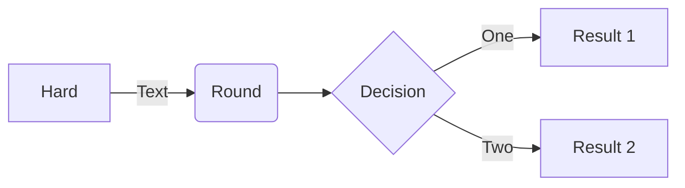

# Blog Scraper

Keeping my personal knowledge library up to date automagically

## Reference
https://docs.python-guide.org/writing/structure/

## ToDo
* make ui module
* Move on to other blogs
* Eugene Yan
* Chip Huyen
* Lenny's Podcast
* Stay Sassy
* Lilian Weng
* store usages

## Maybe Later ToDo
* Build out data structure

## Utils
* Language model stuff
* Logging stuff

### _sample mermaid chart_
