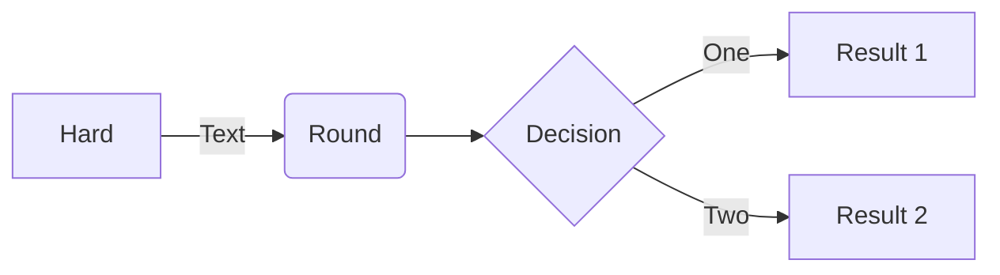

# Blog Scraper

Keeping my personal knowledge library up to date automagically

# To run the main program, first start the virtual environment, then execute the app module
## Create and install dependencies, if necessary
```sh
pyenv activate blogscraper-env
```
```sh
python blogscraper/app.py scrape
```
## To get help
```sh
python blogscraper/app.py -h
```


## Reference
https://docs.python-guide.org/writing/structure/

## ToDo
* Move away from LLM
 * Saasy class, plus some regex ought to do it

* Move on to other blogs
 * Eugene Yan
 * Chip Huyen
 * Lenny's Podcast
 * Lilian Weng

* make ui module
 * working on add-source
 * Update start page of blog
 * Delete a blog
 * List which pages have been scraped for a given blog
 * Create a report of activity in the last N days

* Tests?
* Include the url in the document
* complete docstrings
* automate weekly running of app
* remove unused code
* add "processed X docs in Y seconds"
* add verbose mode
* store usages

## Maybe Later ToDo
* Build out data structure using dataclasses
* Make it work with local language models


### _sample mermaid chart_
